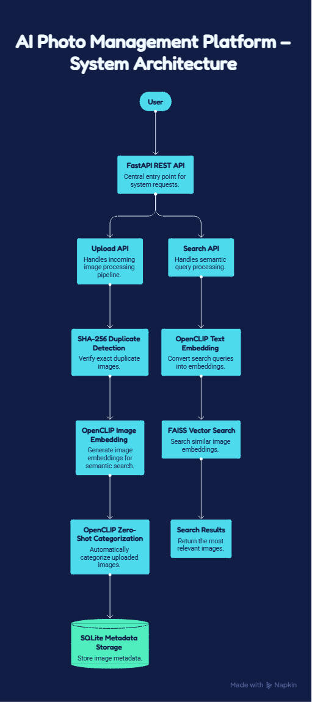

# 📸 AI Photo Management Platform

An AI-powered photo management system built using **FastAPI**, **OpenCLIP**, **FAISS**, and **SQLite**. The platform enables users to upload images, automatically categorize them using AI, detect duplicate images, and perform semantic image search using natural language queries.

Developed as part of the **PanScience Innovations AI Engineering Technical Assessment**.

---

# ✨ Features

## 📤 Image Upload
- Upload images using a REST API.
- Images are stored locally in the `uploads/` directory.

## 🔍 Exact Duplicate Detection
- Uses **SHA-256 hashing** to identify duplicate images.
- Prevents storing the exact same image multiple times.

## 🤖 AI Image Categorization
Automatically categorizes uploaded images using **OpenCLIP Zero-Shot Classification**.

Supported categories include:
- Pet
- Vehicle
- Travel
- Document
- Food
- Person
- Nature
- Building
- Electronics
- Other

## 🧠 Semantic Image Search
Search images using natural language.

Example queries:

```
dog
car
beach
mountain
person
```

The system converts the text query into an embedding using OpenCLIP and retrieves the most semantically similar images using FAISS.

## 📂 Metadata Storage
Stores image metadata in SQLite, including:
- Filename
- File path
- SHA-256 hash
- AI-generated category

---

# 🛠 Tech Stack

| Technology | Purpose |
|------------|---------|
| Python | Programming Language |
| FastAPI | REST API Framework |
| SQLite | Metadata Database |
| SQLAlchemy | ORM |
| OpenCLIP | Image & Text Embeddings |
| FAISS | Vector Similarity Search |
| PyTorch | Deep Learning Backend |
| Pillow | Image Processing |

---

# 🏗️ System Architecture



---

# 📸 Screenshots

## Main Page


## Image Upload


## Semantic Search


---

# 📁 Project Structure

```
AI-Photo-Management-Platform/
│
├── app/
│   ├── __init__.py
│   ├── main.py
│   ├── upload.py
│   ├── search.py
│   ├── embeddings.py
│   └── database.py
│
├── screenshots/
│   ├── main_page.png
│   ├── upload.png
│   └── search.png
│
├── architecture.png
├── Dockerfile
├── requirements.txt
├── README.md
└── .gitignore
```

---

# ⚙️ Installation

### 1. Clone the repository

```bash
git clone https://github.com/yessica007/AI-Photo-Management-Platform.git
cd AI-Photo-Management-Platform
```

### 2. Create a virtual environment

```bash
python -m venv .venv
```

### 3. Activate the virtual environment

**Windows**

```bash
.venv\Scripts\activate
```

**Linux / macOS**

```bash
source .venv/bin/activate
```

### 4. Install dependencies

```bash
pip install -r requirements.txt
```

### 5. Run the application

```bash
uvicorn app.main:app --reload
```

Open your browser and visit:

```
http://127.0.0.1:8000/docs
```

---

# 🐳 Docker

Build the Docker image:

```bash
docker build -t ai-photo-manager .
```

Run the container:

```bash
docker run -p 8000:8000 ai-photo-manager
```

---

# 📡 API Endpoints

| Method | Endpoint | Description |
|--------|----------|-------------|
| GET | `/` | Health check |
| POST | `/upload` | Upload and categorize an image |
| POST | `/search` | Perform semantic image search |

---

# 🔄 Workflow

1. User uploads an image.
2. The system checks for duplicate images using SHA-256.
3. OpenCLIP generates image embeddings.
4. The image is automatically categorized.
5. Metadata is stored in SQLite.
6. Image embeddings are indexed for semantic search.
7. Users can search images using natural language queries.

---

# 🚀 Future Enhancements

- Near-duplicate image detection using embedding similarity.
- Google Photos integration.
- Face recognition and grouping.
- Persistent FAISS index storage.
- User authentication.
- Cloud storage integration.
- OCR support for document images.
- Conversational image search using Retrieval-Augmented Generation (RAG).

---

# 👩‍💻 Author

**Yessica Malhotra**

B.Tech Computer Science (AI & ML)

Developed as part of the **PanScience Innovations AI Engineering Technical Assessment**.